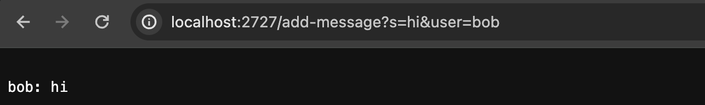
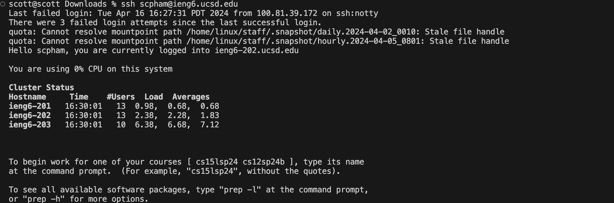

# Lab Report 2

## Part 1

**Chat Server Code**
```
import java.io.IOException;
import java.net.URI;

class Handler implements URLHandler {
    // The one bit of state on the server: a number that will be manipulated by
    // various requests.
    String page = "";

    public String handleRequest(URI url) {
        if (url.getPath().equals("/")) {
            if (page == "") {
            return String.format(" add /add-message?s=<string>&user=<string>");
            } else {
                String.format(page);
            }
        } else if (url.getPath().contains("/add-message")) {
            ///add-message?s=<string>&user=<string>
            String[] parameters = url.getQuery().split("=");
            String message = parameters[1].substring(0,url.getQuery().indexOf("&") - 2);
            String user = parameters[2];
            page += "\n" + user + ": " + message;
            return String.format(page);
            
        } else if (url.getPath().contains("/clear")) {
            page = "";
            return String.format("Cleared messages.");
        }
        
        
        return null;
    } 
}

class ChatServer {
    public static void main(String[] args) throws IOException {
        if(args.length == 0){
            System.out.println("Missing port number! Try any number between 1024 to 49151");
            return;
        }

        int port = Integer.parseInt(args[0]);

        Server.start(port, new Handler());
    }
}

```

**Using Add Message (1)**


**Which methods in your code are called?:** handleRequest method

**What are the relevant arguments to those methods, and the values of any relevant fields of the class?:** Some relevant arguments is the query for the message (hi) and query for the user's name (bob). 

**How do the values of any relevant fields of the class change from this specific request? If no values got changed, explain why.:** The value of "page" updates to add "\n" + user + ": " + message

**Using Add Message (2)**


**Which methods in your code are called?:** handleRequest method

**What are the relevant arguments to those methods, and the values of any relevant fields of the class?:** Some relevant arguments is the query for the message (hello) and query for the user's name (scott). 

**How do the values of any relevant fields of the class change from this specific request? If no values got changed, explain why.:** The value of "page" updates to add "\n" + user + ": " + message

## Part 2

**On the command line of your computer, run ls with the absolute path to the private key for your SSH key for logging into ieng6.**


**On the command line of the ieng6 machine, run ls with the absolute path to the public key for your SSH key for logging into ieng6 (this is the one you copied to your account on ieng6 using ssh-copy-id, so it should be a path on ieng6's file system).**

Public key


**A terminal interaction where you log into your ieng6 account without being asked for a password.**



## Part 3

**In 2-3 sentences, describe something you learned from lab in week 2 or 3 that you didn't know before.**
In labs 2 and 3, I learned how to create an push my own webserver, to share to my classmates. I also learned how to connect to another computer using ssh.
