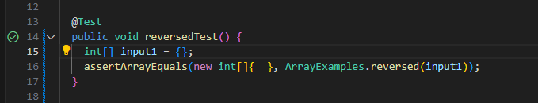

# Part 1: Reversed Bug

## A failure-inducing input for the buggy program, as a JUnit test and any associated code


Failure inducing input
```
@Test 
  public void reversedTest() {
    int[] input1 = {1, 2, 3, 4, 5};
    assertArrayEquals(new int[]{5, 4, 3, 2, 1}, ArrayExamples.reversed(input1));
  }
```

## An input that doesn't induce a failure, as a JUnit test and any associated code

```
@Test 
  public void reversedTest2() {
    int[] input1 = {1, 2, 3, 4, 5};
    assertArrayEquals(new int[]{1, 2, 3, 4, 5}, ArrayExamples.reversed(input1));
  }
```

## The symptom, as the output of running the two tests above




## The bug, as the before-and-after code change required to fix it

Before
```
 static int[] reversed(int[] arr) {
    int[] newArray = new int[arr.length];
    for(int i = 0; i < arr.length; i += 1) {
      arr[i] = newArray[arr.length - i - 1];
    }
    return arr;
  }
```

After
```
  static int[] reversed(int[] arr) {
    int[] newArray = new int[arr.length];
    for(int i = 0; i < arr.length; i += 1) {
      newArray[arr.length - i - 1] = arr[i];
    }
    return newArray;
  }
```

## Briefly describe (2-3 sentences) why the fix addresses the issue

The after code fixes the two errors. First, the bad code was setting elements from the new array which don't even exist yet into the old array. Second, it was returning the old array. The new code correctly sets elements into the new array and returns the new array.

# Part 2 : grep

I asked chatgpt for ways to use grep, the prompt I gave it is at the bottom of the page.

## 1. grep pattern filename
input 1: Here I'm searching for the word "Aziz" in a txt file within the 911report directory.
```
grep Aziz 911report/chapter-1.txt
```
output 1
```
    For those heading to an airport, weather conditions could not have been better for a safe and pleasant journey. Among the travelers were Mohamed Atta and Abdul Aziz al Omari, who arrived at the airport in Portland, Maine.
```

input 2 Here I'm searching for the phrase "9:03" in another txt file.
```
grep 9:03 911report/chapter-9.txt
```
output 2
```
                    2 World Trade Center (the South Tower) at 9:03 until the collapse of the South
                    of the North Tower at 10:28 From 8:46 until 9:03 A.M.
            In the 17-minute period between 8:46 and 9:03 A.M. on September 11, New York City and
            From 9:03 until 9:59 A.M.
            At 9:03:11, the hijacked United Airlines Flight 175 hit 2 WTC (the South Tower) from
                companies, as units that had been in or en route to the North Tower lobby at 9:03
                that had been dispatched to the North Tower prior to 9:03 reported immediately to
            Throughout this period (9:03 to 9:59), a group of NYPD and Port Authority police

```

## 2. grep -c pattern file

input 1: Here I'm counting how many times the phrase "flight" appears in a txt file.
```
grep -c flight 911report/chapter-1.txt
```
output 1
```
74
```

input 2: Here I'm counting how many times the phrase "New" appears in a txt file.
```
grep -c New 911report/chapter-1.txt
```
output 2
```
50
```

## 3. grep -r pattern directory

input 1: Here I'm searching for lines that contain "Omari" within all files within a specified directory.
```
grep -r Omari 911report/
```
output 1
```
911report/chapter-1.txt:    For those heading to an airport, weather conditions could not have been better for a safe and pleasant journey. Among the travelers were Mohamed Atta and Abdul Aziz al Omari, who arrived at the airport in Portland, Maine.
911report/chapter-1.txt:    Boston: American 11 and United 175. Atta and Omari boarded a 6:00 A.M. flight from Portland to Boston's Logan International Airport.
911report/chapter-1.txt:    Atta and Omari arrived in Boston at 6:45. Seven minutes later, Atta apparently took a call from Marwan al Shehhi, a longtime colleague who was at another terminal at Logan Airport. They spoke for three minutes.
911report/chapter-1.txt:    Between 6:45 and 7:40, Atta and Omari, along with Satam al Suqami, Wail al Shehri, and Waleed al Shehri, checked in and boarded American Airlines Flight 11, bound for Los Angeles. The flight was scheduled to depart at 7:45.
911report/chapter-1.txt:    While Atta had been selected by CAPPS in Portland, three members of his hijacking team-Suqami, Wail al Shehri, and Waleed al Shehri-were selected in Boston. Their selection affected only the handling of their checked bags, not their screening at the checkpoint. All five men cleared the checkpoint and made their way to the gate for American 11. Atta, Omari, and Suqami took their seats in business class (seats 8D, 8G, and 10B, respectively). The Shehri brothers had adjacent seats in row 2 (Wail in 2A, Waleed in 2B), in the firstclass cabin. They boarded American 11 between 7:31 and 7:40. The aircraft pushed back from the gate at 7:40.
911report/chapter-1.txt:    At the same time or shortly thereafter, Atta-the only terrorist on board trained to fly a jet-would have moved to the cockpit from his business-class seat, possibly accompanied by Omari. As this was happening, passenger Daniel Lewin, who was seated in the row just behind Atta and Omari, was stabbed by one of the hijackers-probably Satam al Suqami, who was seated directly behind Lewin. Lewin had served four years as an officer in the Israeli military. He may have made an attempt to stop the hijackers in front of him, not realizing that another was sitting behind him.
911report/chapter-13.2.txt:                of why Atta and Omari drove to Portland, Maine, from Boston on the morning of
911report/chapter-13.4.txt:                Nouri, Sept. 19, 2001. Although no specific evidence places Omari in the apartment,
911report/chapter-13.4.txt:                8, 2002. For Omari's, Ghamdi's, and Shehri's backgrounds, see CIA analytic report,
911report/chapter-13.4.txt:                Ghamdi (June 12), Khalid al Mihdhar (June 13), Abdul Aziz Omari (June 18) and Salem
911report/chapter-13.4.txt:            106. Only the passports of Satam al Suqami and Abdul Aziz al Omari were recovered
911report/chapter-13.5.txt:                photos of Rashid and three 9/11 hijackers-Nawaf al Hazmi, Mihdhar, and Omari-were
911report/chapter-13.5.txt:                (Flight 77) and Omari (Flight 11) arrived at JFK on June 29, 2001, from Dubai with a
911report/chapter-13.5.txt:                connection in Zurich. INS records, arrival records of Salem al Hazmi and Omari, June
911report/chapter-13.5.txt:                11297; Bern EC (Omari PNR, Swiss Air); 265A-NY-280350-302, serial 60839). On Salem
911report/chapter-13.5.txt:                the smaller airport, he and Omari had to pass through security again at Logan. Ibid.
911report/chapter-13.5.txt:                Suqami and Abdul Aziz al Omari) presented passports manipulated in a fraudulent
911report/chapter-7.txt:                Hanjour, Moqed, probably Ahmed al Ghamdi, and Abdul Aziz al Omari; Hazmi's old
911report/chapter-7.txt:                Omari, Ahmed al Ghamdi, Hamza al Ghamdi, Mohand al Shehri, Majed Moqed, Salem al
911report/chapter-7.txt:            Five more-Wail al Shehri, Waleed al Shehri, Abdul Aziz al Omari, Mohand al Shehri,
911report/chapter-7.txt:                university studies. Omari had graduated with honors from high school, had attained a
911report/chapter-7.txt:                prayer services regularly and Omari often served as an imam at his mosque in Saudi
911report/chapter-7.txt:                by unnamed Saudi sheikhs who had contacts with al Qaeda. Omari, for example, is
911report/chapter-7.txt:                Shehri, Omari, Nami, Hamza al Ghamdi, Salem al Hazmi, and Moqed.
911report/chapter-7.txt:                Hazmi. Two days later, Ahmed al Ghamdi and Abdul Aziz al Omari, who had been living
911report/chapter-7.txt:                and Atta was seen with him at his hotel. The next day, Atta picked up Omari at
```

input 2: Here I'm searching for lines that contain "Bush" within all files within a specified directory.
```
grep -r Bush government/
```
output 2
```
government/About_LSC/State_Planning_Report.txt:A planning grant from the Bush Foundation to identify
government/About_LSC/State_Planning_Report.txt:funding from the Bush Foundation has represented a major step
government/About_LSC/State_Planning_Report.txt:is also pending before the Bush Foundation.
government/Alcohol_Problems/Session2-PDF.txt:45. Cleary P, Miller M, Bush B, Warburg M, Delbanco T, Aronson
government/Env_Prot_Agen/final.txt:When President George H.W. Bush signed the Clean Air Act
government/Env_Prot_Agen/final.txt:President Bush has not only promised to take the SO2 trading
government/Env_Prot_Agen/final.txt:matter. In 1999, then-Governor Bush signed legislation that
government/Env_Prot_Agen/final.txt:cabinet-level review for this issue. On June 11, President Bush
government/Env_Prot_Agen/final.txt:health and environmental problems. President Bush's National Energy
government/Env_Prot_Agen/multi102902.txt:13. Personal Communication with J. Bushman, Alstom Power,
government/Env_Prot_Agen/multi102902.txt:27. Personal Communication with J. Bushman of Alstom, August 8,
government/Env_Prot_Agen/multi102902.txt:37. Personal Communication with John Bushman, Alstom, July 10,
government/Env_Prot_Agen/nov1.txt:George H. W. Bush signed into law the most far reaching amendments
government/Env_Prot_Agen/ro_clear_skies_book.txt:Today, President Bush proposed the most significant step America
government/Env_Prot_Agen/ro_clear_skies_book.txt:supply in the years ahead. President Bush has often said that
government/Env_Prot_Agen/ro_clear_skies_book.txt:Bush is proposing a new Clean Air Act for the 21st century.
government/Env_Prot_Agen/ro_clear_skies_book.txt:President Bush has a strong track record on enacting
government/Env_Prot_Agen/ro_clear_skies_book.txt:far-reaching clean air initiatives. In 1999, then-Governor Bush
government/Env_Prot_Agen/ro_clear_skies_book.txt:by President George H.W. Bush, have significantly reduced air
government/Env_Prot_Agen/ro_clear_skies_book.txt:This program is clearly a model for success. President Bush
government/Gen_Account_Office/Testimony_d01609t.txt:the House, and delay in filling many Bush Administration policy
government/Gen_Account_Office/Testimony_Jul15-2002_d02940t.txt:In August 2001, President Bush placed human capital at
government/Gen_Account_Office/Testimony_Jul17-2002_d02957t.txt:Security, President George W. Bush, June 2002.
government/Media/Barnes_new_job.txt:our national creed. I, for one, will not forget President Bush's
government/Media/Barr_sharpening_ax.txt:President Bush is expected to name new board members soon, and
government/Media/Eviction_law.txt:the Clinton administration in 1996 and by the Bush administration
government/Media/FY_04_Budget_Outlook.txt:fiscal 2004 under President Bush's proposal - the same amount
government/Media/Local_Attorneys.txt:legal services must wait to see who President Bush appoints to the
government/Media/man_on_national_team.txt:with pictures of him with President Bush and first lady Laura Bush,
government/Media/man_on_national_team.txt:Subia was nominated by President Bush to the board of directors
government/Media/man_on_national_team.txt:words then-Gov. Bush told him that give him the confidence he
government/Media/man_on_national_team.txt:Subia's friendship with the Bushes began through a tragic event
government/Media/man_on_national_team.txt:then-Texas first lady Laura Bush, they stopped at the home and Bush
government/Media/man_on_national_team.txt:about them, which is why the Bushes have always wanted to see them
government/Media/Poor_Lacking_Legal_Aid.txt:For the second consecutive year, President Bush in February
government/Post_Rate_Comm/Mitchell_RMVancouver.txt:policy, senders of parcels to residents in the Alaska Bush (which
```

## 4. grep -v pattern file

input 1: Here I'm searching for all lines that DO NOT contain "and" within a specified file.
```
grep -v and 911report/chapter-1.txt
```
output 1
```


"WE HAVE SOME PLANES"


INSIDE THE FOUR FLIGHTS

Boarding the Flights


    When he checked in for his flight to Boston, Atta was selected by a computerized prescreening system known as CAPPS (Computer Assisted Passenger Prescreening System), created to identify passengers who should be subject to special security measures. Under security rules in place at the time, the only consequence of Atta's selection by CAPPS was that his checked bags were held off the plane until it was confirmed that he had boarded the aircraft. This did not hinder Atta's plans.


    It would be their final conversation.


    Their flight was scheduled to depart at 8:00.


    None of the checkpoint supervisors recalled the hijackers or reported anything suspicious regarding their screening.


    All five hijackers passed through the Main Terminal's west security screening checkpoint; United Airlines, which was the responsible air carrier, had contracted out the work to Argenbright Security.


    The 19 men were aboard four transcontinental flights.


    At 8:44, Gonzalez reported losing phone contact with Ong. About this same time Sweeney reported to Woodward, "Something is wrong. We are in a rapid descent . . . we are all over the place." Woodward asked Sweeney to look out the window to see if she could determine where they were. Sweeney responded:"We are flying low. We are flying very, very low. We are flying way too low." Seconds later she said,"Oh my God we are way too low." The phone call ended.

    At 8:46:40, American 11 crashed into the North Tower of the World Trade Center in New York City.

    All on board, along with an unknown number of people in the tower, were killed instantly.


    At 8:58, the flight took a heading toward New York City.


    At 9:03:11, United Airlines Flight 175 struck the South Tower of the World Trade Center.

    All on board, along with an unknown number of people in the tower, were killed instantly.


    At 9:00, American Airlines Executive Vice President Gerard Arpey learned that communications had been lost with American 77. This was now the second American aircraft in trouble. He ordered all American Airlines flights in the Northeast that had not taken off to remain on the ground. Shortly before 9:10, suspecting that American 77 had been hijacked, American headquarters concluded that the second aircraft to hit the World Trade Center might have been Flight 77. After learning that United Airlines was missing a plane, American Airlines headquarters extended the ground stop nationwide.  


    At 9:32, controllers at the Dulles Terminal Radar Approach Control "observed a primary radar target tracking eastbound at a high rate of speed." This was later determined to have been Flight 77. 


    At 9:37:46, American Airlines Flight 77 crashed into the Pentagon, traveling at approximately 530 miles per hour.


    At the same time, Boston Center realized that a message transmitted just before 8:25 by the hijacker pilot of American 11 included the phrase, "We have some planes."


    Several FAA air traffic control officials told us it was the air carriers' responsibility to notify their planes of security problems. One senior FAA air traffic control manager said that it was simply not the FAA's place to order the airlines what to tell their pilots.


    On the morning of 9/11, there were only 37 passengers on United 93-33 in addition to the 4 hijackers. This was below the norm for Tuesday mornings during the summer of 2001. But there is no evidence that the hijackers manipulated passenger levels or purchased additional seats to facilitate their operation.


    The cockpit voice recorder data indicate that a woman, most likely a flight attendant, was being held captive in the cockpit. She struggled with one of the hijackers who killed or otherwise silenced her.


    Passengers on three flights reported the hijackers' claim of having a bomb. The FBI told us they found no trace of explosives at the crash sites. One of the passengers who mentioned a bomb expressed his belief that it was not real. Lacking any evidence that the hijackers attempted to smuggle such illegal items past the security screening checkpoints, we believe the bombs were probably fake. 


    At 9:57, the passenger assault began. Several passengers had terminated phone calls with loved ones in order to join the revolt. One of the callers ended her message as follows:"Everyone's running up to first class. I've got to go. Bye."

    The cockpit voice recorder captured the sounds of the passenger assault muffled by the intervening cockpit door. Some family members who listened to the recording report that they can hear the voice of a loved one among the din. We cannot identify whose voices can be heard. But the assault was sustained.


    Jarrah's objective was to crash his airliner into symbols of the American Republic, the Capitol or the White House. He was defeated by the alerted, unarmed passengers of United 93.

IMPROVISING A HOMELAND DEFENSE


    Controllers track airliners such as the four aircraft hijacked on 9/11 primarily by watching the data from a signal emitted by each aircraft's transponder equipment. Those four planes, like all aircraft traveling above 10,000 feet, were required to emit a unique transponder signal while in flight.


    NORAD perceived the dominant threat to be from cruise missiles. Other threats were identified during the late 1990s, including terrorists' use of aircraft as weapons. Exercises were conducted to counter this threat, but they were not based on actual intelligence. In most instances, the main concern was the use of such aircraft to deliver weapons of mass destruction.


    NEADS reported to the Continental U.S. NORAD Region (CONR) headquarters, in Panama City, Florida, which in turn reported to NORAD headquarters, in Colorado Springs, Colorado.


    FAA guidance to controllers on hijack procedures assumed that the aircraft pilot would notify the controller via radio or by"squawking"a transponder code of "7500"-the universal code for a hijack in progress. Controllers would notify their supervisors, who in turn would inform management all the way up to FAA headquarters in Washington. Headquarters had a hijack coordinator, who was the director of the FAA Office of Civil Aviation Security or his or her designate.


    The protocols did not contemplate an intercept. They assumed the fighter escort would be discreet, "vectored to a position five miles directly behind the hijacked aircraft," where it could perform its mission to monitor the aircraft's flight path.


the hijacking would take the traditional form: that is, it would not be a suicide hijacking designed to convert the aircraft into a guided missile.


    On the morning of 9/11, the existing protocol was unsuited in every respect for what was about to happen.

American Airlines Flight 11

FAA Awareness. Although the Boston Center air traffic controller realized at an early stage that there was something wrong with American 11, he did not immediately interpret the plane's failure to respond as a sign that it had been hijacked. At 8:14, when the flight failed to heed his instruction to climb to 35,000 feet, the controller repeatedly tried to raise the flight. He reached out to the pilot on the emergency frequency. Though there was no response, he kept trying to contact the aircraft.


    At 8:34, the Boston Center controller received a third transmission from American 11:

    American 11: Nobody move please. We are going back to the airport. Don't try to make any stupid moves.

    In the succeeding minutes, controllers were attempting to ascertain the altitude of the southbound flight.


    NEADS: Is this real-world or exercise?

    FAA: No, this is not an exercise, not a test.

    NEADS ordered to battle stations the two F-15 alert aircraft at Otis Air Force Base in Falmouth, Massachusetts, 153 miles away from New York City. The air defense of America began with this call.


    In summary, NEADS received notice of the hijacking nine minutes before it struck the North Tower. That nine minutes' notice before impact was the most the military would receive of any of the four hijackings.

United Airlines Flight 175

FAA Awareness. One of the last transmissions from United Airlines Flight 175 is, in retrospect, chilling. By 8:40, controllers at the FAA's New York Center were seeking information on American 11. At approximately 8:42, shortly after entering New York Center's airspace, the pilot of United 175 broke in with the following transmission:

    UAL 175: New York UAL 175 heavy.

    FAA: UAL 175 go ahead.


    FAA: Oh, okay. I'll pass that along over here.


    Manager, New York Center: We have several situations going on here. It's escalating big, big time. We need to get the military involved with us. . . . We're, we're involved with something else, we have other aircraft that may have a similar situation going on here.


    Terminal: I got somebody who keeps coasting but it looks like he's going into one of the small airports down there.


    Terminal: Got him just out of 9,500-9,000 now.

    Center: Do you know who he is?

    Terminal: We're just, we just we don't know who he is. We're just picking him up now.

    Center (at 9:02): Alright. Heads up man, it looks like another one coming in.

    The controllers observed the plane in a rapid descent; the radar data terminated over Lower Manhattan. At 9:03, United 175 crashed into the South Tower.

    Meanwhile, a manager from Boston Center reported that they had deciphered what they had heard in one of the first hijacker transmissions from American 11: Boston Center: Hey . . . you still there?


    Unidentified Female Voice: They have what?

    Boston Center: Planes, as in plural.

    Boston Center: It sounds like, we're talking to New York, that there's another one aimed at the World Trade Center.


    Boston Center: A second one just hit the Trade Center.


    American Airlines Flight 77 FAA Awareness. American 77 began deviating from its flight plan at 8:54, with a slight turn toward the south. Two minutes later, it disappeared completely from radar at Indianapolis Center, which was controlling the flight.


    The reasons are technical, arising from the way the software processed radar information, as well as from poor primary radar coverage where American 77 was flying.


    FAA: Yes.

    NEADS: On its way towards Washington?

    FAA: That was another-it was evidently another aircraft that hit the tower. That's the latest report we have.

    NEADS: Okay.

    FAA: I'm going to try to confirm an ID for you, but I would assume he's somewhere over, uh, either New Jersey or somewhere further south.

    NEADS: Okay. So American 11 isn't the hijack at all then, right? FAA: No, he is a hijack.

    NEADS: He-American 11 is a hijack?

    FAA: Yes.

    NEADS: And he's heading into Washington?

    FAA: Yes. This could be a third aircraft.


    After the 9:36 call to NEADS about the unidentified aircraft a few miles from the White House, the Langley fighters were ordered to Washington, D.C. Controllers at NEADS located an unknown primary radar track, but "it kind of faded" over Washington. The time was 9:38. The Pentagon had been struck by American 77 at 9:37:46. The Langley fighters were about 150 miles away.


    But another aircraft was heading toward Washington, an aircraft about which NORAD had heard nothing: United 93.


    There was no response.


    FAA Headquarters: Oh, God, I don't know.


    FAA Headquarters: Uh, ya know everybody just left the room.


    FAA Headquarters: Yes.


    FAA Headquarters: From the airplane or from the ground?


    Despite the discussions about military assistance, no one from FAA headquarters requested military assistance regarding United 93. Nor did any manager at FAA headquarters pass any of the information it had about United 93 to the military.


    FAA (DC): Go ahead.

    NEADS: United nine three, have you got information on that yet? FAA: Yeah, he's down.

    NEADS: He's down?

    FAA: Yes.


    NEADS: Oh, he's down? Down?

    FAA: Yes. Somewhere up northeast of Camp David.

    NEADS: Northeast of Camp David.

    FAA: That's the last report. They don't know exactly where.

    The time of notification of the crash of United 93 was 10:15. The NEADS air defenders never located the flight or followed it on their radar scopes. The flight had already crashed by the time they learned it was hijacked.

Clarifying the Record


    In public testimony before this Commission in May 2003, NORAD officials stated that at 9:16, NEADS received hijack notification of United 93 from the FAA. This statement was incorrect. There was no hijack to report at 9:16. United 93 was proceeding normally at that time.


    In fact, not only was the scramble prompted by the mistaken information about American 11, but NEADS never received notice that American 77 was hijacked. It was notified at 9:34 that American 77 was lost. Then, minutes later, NEADS was told that an unknown plane was 6 miles southwest of the White House. Only then did the already scrambled airplanes start moving directly toward Washington, D.C.


    Nor did the military have 47 minutes to respond to United 93, as would be implied by the account that it received notice of the flight's hijacking at 9:16. By the time the military learned about the flight, it had crashed. We now turn to the role of national leadership in the events that morning.

NATIONAL CRISIS MANAGEMENT

    When American 11 struck the World Trade Center at 8:46, no one in the White House or traveling with the President knew that it had been hijacked. While that information circulated within the FAA, we found no evidence that the hijacking was reported to any other agency in Washington before 8:46.

    Most federal agencies learned about the crash in New York from CNN.


    Others in the agency were aware of it, as we explained earlier in this chapter.


    At the White House, Vice President Dick Cheney had just sat down for a meeting when his assistant told him to turn on his television because a plane had struck the NorthTower of the World Trade Center. The Vice President was wondering "how the hell could a plane hit the World Trade Center" when he saw the second aircraft strike the South Tower.

    Elsewhere in the White House, a series of 9:00 meetings was about to begin. In the absence of information that the crash was anything other than an accident, the White House staff monitored the news as they went ahead with their regular schedules.

The Agencies Confer

    When they learned a second plane had struck the World Trade Center, nearly everyone in the White House told us, they immediately knew it was not an accident. The Secret Service initiated a number of security enhancements around the White House complex. The officials who issued these orders did not know that there were additional hijacked aircraft, or that one such aircraft was en route to Washington. These measures were precautionary steps taken because of the strikes in New York.


    On the morning of September 11, Secretary Rumsfeld was having breakfast at the Pentagon with a group of members of Congress. He then returned to his office for his daily intelligence briefing. The Secretary was informed of the second strike in New York during the briefing; he resumed the briefing while awaiting more information. After the Pentagon was struck, Secretary Rumsfeld went to the parking lot to assist with rescue efforts.


    The President remained in the classroom for another five to seven minutes,


    The Vice President remembered placing a call to the President just after entering the shelter conference room. There is conflicting evidence about when the Vice President arrived in the shelter conference room. We have concluded, from the available evidence, that the Vice President arrived in the room shortly before 10:00, perhaps at 9:58. The Vice President recalled being told, just after his arrival, that the Air Force was trying to establish a combat air patrol over Washington.


    We believe this call would have taken place sometime before 10:10 to 10:15.


    The Vice President was logged calling the President at 10:18 for a twominute conversation that obtained the confirmation. On Air Force One, the President's press secretary was taking notes; Ari Fleischer recorded that at 10:20, the President told him that he had authorized a shootdown of aircraft if necessary.


    At approximately 10:30, the shelter started receiving reports of another hijacked plane, this time only 5 to 10 miles out. Believing they had only a minute or two, the Vice President again communicated the authorization to "engage or "take out" the aircraft. At 10:33, Hadley told the air threat conference call: "I need to get word to Dick Myers that our reports are there's an inbound aircraft flying low 5 miles out. The Vice President's guidance was we need to take them out."


    NORAD had no information either. At 10:07, its representative on the air threat conference call stated that NORAD had "no indication of a hijack heading to DC at this time."


    Controllers: Copy that, sir.


    Floor Leadership: No? It came over the chat. . . . You got a conflict on that direction?


    At 10:39, the Vice President updated the Secretary on the air threat conference: Vice President: There's been at least three instances here where we've had reports of aircraft approaching Washington-a couple were confirmed hijack. And, pursuant to the President's instructions I gave authorization for them to be taken out. Hello?


    Vice President: It was passed from here through the [operations] center at the White House, from the [shelter].

    SecDef: OK, let me ask the question here. Has that directive been transmitted to the aircraft?

    Vice President: Yes, it has.

    SecDef: So we've got a couple of aircraft up there that have those instructions at this present time?


    SecDef: We can't confirm that. We're told that one aircraft is down but we do not have a pilot report that did it.


What If?

    NORAD officials have maintained consistently that had the passengers not caused United 93 to crash, the military would have prevented it from reaching Washington, D.C. That conclusion is based on a version of events that we now know is incorrect. The Langley fighters were not scrambled in response to United 93; NORAD did not have 47 minutes to intercept the flight; NORAD did not even know the plane was hijacked until after it had crashed. It is appropriate, therefore, to reconsider whether United 93 would have been intercepted.


    Second, NEADS did not have accurate information on the location of United 93. Presumably FAA would have provided such information, but we do not know how long that would have taken, nor how long it would have taken NEADS to locate the target.
```

input 2: Here I'm searching for all lines that DO NOT contain "medicine" within a specified file.
```
grep -v medicine biomed/1468-6708-3-1.txt
```
output 2
```
Introduction
        Older adults are frequently counseled to lose weight,
        even though there is little evidence that overweight is
        associated with increased mortality in those over age 65.
        Six large controlled population-based studies of
        non-smoking older adults have investigated the association
        between body mass index (BMI) and mortality, controlling
        for relevant covariates [ 1 2 3 4 5 6 ] . All studies found
        excess risk for persons with very low BMI, but that persons
        with moderately high BMI had little or no extra risk except
        in certain small subsets. A review of 13 studies of older
        adults drew similar conclusions [ 7 ] .
        Many healthy older adults report gradual weight gain
        throughout adult life. It may be that a small amount of
        gradual weight gain is normative and associated with the
        most robust health as we age. It has been suggested that
        weight standards be adjusted upwards for age [ 8 ] . Such
        recommendations remain controversial, however, because the
        number of studies of older persons is fairly small, and
        because few studies have examined the relation of BMI to
        quality of life or years of healthy life (YHL) in the
        elderly [ 9 ] .
        In older adults, risk factors may have a greater effect
        on health than on mortality. If so, then behavior change
        trials of weight modification might be more successful if
        they were evaluated on improved health, rather than on
        decreased mortality. Clinical trials powered to detect
        differences in YHL would often require fewer subjects than
        trials to detect survival differences or cardiovascular
        events [ 10 ] . In this paper we study whether BMI at
        baseline is associated with living longer, and/or with more
        years of being healthy, in a cohort of older adults for
        whom risk factors, subclinical disease, and morbidity are
        well characterized. The goal is to determine whether
        analyses based on years of life (YOL) or on YHL would
        provide substantively different results, and which measure
        would yield more powerful evaluations of weight
        modification interventions in older adults.


        Materials and methods

          Study design: The Cardiovascular Health
          Study
          The Cardiovascular Health Study (CHS) is a
          population-based longitudinal study of 5,888 adults aged
          65 and older at baseline [ 11 ] . Subjects were recruited
          from a random sample of the Medicare eligibility lists in
          four US counties. Extensive baseline data were collected
          for all subjects using a baseline home interview, an
          annual mail questionnaire, and annual clinic
          examinations. Additional information was collected in a
          brief telephone interview 6 months after each scheduled
          visit. Two cohorts were followed, one with 7 years of
          follow-up (n = 5,201) and the second (all African
          American, n = 687) with 4 years of follow-up to date.
          Data collection began in 1989, and follow-up is virtually
          complete for all surviving subjects [ 12 ] .


          Body mass index
          BMI was calculated as measured weight in kilograms
          divided by the square of measured height in meters. A
          report from the National Heart Lung and Blood Institute
          classifies normal weight (without reference to age) as a
          BMI of 18.5 to 24.9; overweight as 25 to 29.9; and
          obesity as 30.0 and higher [ 13 ] . We consider
          separately the group with BMI between 18.5 and 20, which
          was associated with lower survival in studies cited
          above.


          Years of life and years of healthy life
          YOL is the number of years that a person lived in the
          7 years after baseline. YHL is the number of years in
          which the person was 'healthy', and is similar in concept
          to quality-adjusted life-years, healthy year equivalents,
          or active life expectancy [ 14 ] . We based YHL on
          self-rated health (is your health excellent, very good,
          good, fair, or poor?) (EVGFP) which was collected every 6
          months. EVGFP is a simple but well-known measure, which
          has been studied in detail [ 15 16 ] , and is predictive
          of health events in many studies [ 17 ] . Because we are
          examining health status over time, we added a sixth
          health state, dead. Data were available about 93% of the
          time. We used linear interpolation to estimate missing
          data when there were known values before and after the
          missing value, bringing the percent complete to 95% [ 18
          ] .
          For this analysis we defined YHL as the number of
          years (of 7) in which a person reported excellent, very
          good, or good health (were 'healthy'). YHL ranges from 0
          (for persons who were never in excellent, very good, or
          good health) to 7 years (for persons who were healthy
          throughout). Since people reported their health every 6
          months, YHL has a reasonably continuous distribution. A
          drawback of this simple definition of 'healthy' is that
          it does not distinguish between fair or poor health and
          death, since all are considered 'not healthy'. We also
          used an alternative approach, which assigns a different
          value to each level of EVGFP [ 19 ] . Preliminary results
          were similar for the two approaches, however, and we
          report results using only the simpler definition.
          The calculations had to be modified to include the 438
          persons in the second African American cohort, who have
          been followed only 4 years to date. For those persons,
          and for 70 persons in the first cohort who did not have
          complete data, we estimated the last 4 years of YOL and
          YHL from their age, sex, and health at the end of 3
          years, using validated methods presented elsewhere [ 20 ]
          . That article showed that estimated 4-year YOL and YHL
          were unbiased for the African American cohort. In the
          primary analysis we used observed 7-year YOL and YHL when
          they were available, and observed 3-year YOL and YHL plus
          4-year estimated YOL and YHL when they were not (about
          10% of the sample). We performed all analyses with and
          without the persons who had partially estimated data, to
          ensure that the estimation had not distorted the
          findings.


          Covariates
          The goal is to examine the association of YOL and YHL
          with BMI. To adjust for possible confounding we chose
          baseline covariates that were prevalent in the elderly,
          related to mortality and morbidity in previous studies,
          and likely to be related to BMI. Self-reported covariates
          include age, gender, smoking (never or former), history
          of arthritis, cancer, diabetes, fair or poor self-rated
          health status, limitations in activities of daily living
          or in instrumental activities of daily living, and 10
          pounds or more unintended weight loss in the year before
          baseline. Clinical covariates include hypertension,
          cardiovascular disease (prevalent heart disease,
          peripheral vascular disease, or cerebrovascular disease),
          maximum thickness of the internal carotid artery,
          depression (CESD score), serum albumin, serum
          cholesterol, and serum creatinine. These measures are
          explained in more detail elsewhere [ 21 22 23 24 ] . We
          excluded 697 current smokers and 313 others with
          incomplete covariate data, leaving 4,878 persons on whom
          this analysis is based.


          Analysis
          All analyses were performed separately for men and
          women. We calculated two sets of adjusted values, as
          follows. We regressed YOL and YHL first on age, age
          squared, race, and smoking history (former or never), and
          second on all of the covariates listed above. We
          calculated adjusted YOL as a person's observed YOL minus
          predicted YOL (from the regression) plus the mean YOL
          (6.52 years for women or 6.06 for men). That is, a
          person's adjusted YOL is his residual from the regression
          plus the grand mean. The mean of this new variable, for a
          group of subjects, is the adjusted mean YOL for that
          group. Adjusted YHL was calculated in a similar manner.
          We calculated two sets of adjusted variables because of
          the possibility of 'over-adjustment', controlling
          inappropriately for factors (such as diabetes) which may
          have been causally affected by the person's weight. We
          plotted mean adjusted YOL and YHL against BMI, and tested
          for difference among BMI groups using confidence
          intervals or analysis of variance. Finally we calculated
          the effect size for each measure, comparing each BMI
          subgroup to the 'normal' group. The effect size is the
          difference in mean YOL (or YHL) in two groups divided by
          their common standard deviation. Since the sample size
          required to detect an effect of this magnitude is
          proportional to the inverse of the squared effect size,
          large effect sizes are desirable.


        Results
        Table 1shows the distribution of key variables by sex
        and race. Mean age at baseline was 73.1 and about two
        thirds of the men and a third of the women were former
        smokers. Black women had a higher mean BMI and higher
        percent obese (BMI ≥ 30) than the other three groups. Black
        men were most likely to have unintentionally lost more than
        10 pounds in the past year; white women were least
        likely.
        About 78% of the subjects were healthy at baseline,
        declining to 57% at the end of 7 years; 20% had died (data
        not shown). Of the 22% who were unhealthy (fair or poor) at
        baseline, about 24% were healthy 7 years later. There was
        thus substantial change in EVGFP over time, in both
        directions. Table 1shows the mean YOL and YHL (calculated
        from EVGFP) in the first seven years of the study, adjusted
        to age 73. For example, black women averaged 6.3 YOL, but
        only 4.2 YHL of a maximum possible 7. We calculated some
        additional descriptive statistics, shown in the final two
        lines: years of unhealthy life (YOL minus YHL) and years
        lost to death (7 minus YOL). White women had the most YHL
        and black men the fewest; black women had the most years of
        unhealthy life, and white men the fewest; black men lost
        the most years to death (1.3 out of 7) while white women
        lost only 0.4 years. For blacks, about 68% of their YOL
        were healthy (YHL/YOL, not shown); for whites, about 75%
        were healthy.
        Among whites, the gender differences in Table 1were
        statistically significant (p <.05) except for BMI and
        unintended weight loss. Among blacks, gender differences
        were significant except for 10 pounds unintended weight
        loss and weight loss since age 50. Among males, there were
        significant differences between black and white for BMI,
        unintended weight loss, YOL, YHL, years of unhealthy life,
        and years lost to death. Whites in the sample had higher
        income and education (data not shown). After adjusting for
        income and education, as well as age and former smoking,
        the difference in BMI was no longer statistically
        significant. Among females, blacks and whites differed
        significantly on BMI, BMI>30, weight loss since age 50,
        YOL, YHL, years of unhealthy life, and years lost to death.
        After adjustment for income and education, the difference
        in weight loss since age 50 was no longer significant.
        Blacks had significantly lower YOL and YHL than whites
        after adjustment for age, but the difference disappeared
        after adjustment for the entire set of health-related
        baseline covariates (analyses not shown).
        We next examined the relationship of BMI to YOL and YHL.
        Table 2presents the mean values of YOL and YHL, adjusted
        for age, race, and previous smoking (columns 1 and 3), and
        also adjusted for the entire set of covariates (columns 2
        and 4). For example, YOL for women, adjusted for age, race,
        and smoking, averaged 6.0 years for women with a baseline
        BMI below 18.5, but averaged 6.6 years for women with a BMI
        from 25 to 29.9. The second column, which shows results
        adjusted for all covariates, is not very different (the
        only discrepancy is for men with BMI < 18.5, a category
        containing only 14 men). Adjustment for extensive
        covariates also made little difference for YHL (columns 3
        and 4). Subsequent analyses are adjusted only for age,
        race, and former smoking. As mentioned above, the group
        with BMI from 18.5 to 20 would be considered 'normal' by
        the NHLBI guidelines, but had lower YOL and YHL than those
        with 20-24.9 in all comparisons. For this reason, and to
        increase sample size for those with low BMI, we combined
        the two lower categories, defining underweight as a BMI
        under 20.
        Figure 1is a plot of adjusted YOL and YHL by sex and
        BMI. For each BMI category the mean and its 95% confidence
        interval are plotted. Categories whose confidence intervals
        do not overlap, or overlap only slightly, are significantly
        different. The bars are slightly offset to permit all error
        bars to be seen.
        YOL for women (the uppermost curve on Figure 1) averaged
        about 6.5 out of 7 years, and showed no evident association
        between BMI and YOL for BMI above 20. Underweight women
        averaged about .25 fewer YOL than other women (p < .05
        compared with normal group). Underweight men also had lower
        YOL, but this group was not significantly different from
        the normal group, in part because of low sample size. Men
        classified as normal, overweight or obese all had about the
        same YOL.
        The lowermost two lines in Figure 1show mean YHL for
        women and men. Women who were normal or overweight averaged
        about 4.9 YHL. The YHL for underweight or obese women was
        about 4.5 years, which was significantly lower than the
        normal group. The relationship of BMI to YHL for men is
        similar, but differences among BMI groups were not
        statistically significant. YHL was significantly higher for
        women than for men in the normal and overweight groups, but
        the sexes had similar YHL in the underweight and obese
        groups.
        We next present the effect size for comparing each group
        to the normal BMI group. The effect sizes are shown in
        Table 3, with the significance results of the associated
        t-tests for the differences in means of the two groups
        being compared. For example, underweight women averaged
        4.50 YHL compared to 4.92 for normal women, and the common
        standard deviation was 1.44. The effect size is thus
        (4.92-4.50)/1.44 = .29. The two groups had significantly
        different YHL, implying that the effect size is also
        significantly greater than zero. A clinical trial of a
        treatment to help underweight women achieve normal weight
        (presumably by addressing the underlying cause) could be
        expected to have 80% power with N = (1.96+.84) 2/.29 2=
        about 93 women per treatment arm, if 7-year YHL were the
        outcome measure.
        The biggest effect sizes are in the first row, comparing
        underweight to normal. YHL and YOL have similar effect
        sizes for women, and are significantly different from zero.
        The effect sizes are not significantly different from zero
        for men, in part because there were only 42 men in the
        underweight category. The effect size comparing overweight
        to normal yielded small, non-significant effect sizes, with
        inconsistent signs, suggesting extremely large sample sizes
        would be needed. For comparing obese to normal, only YHL
        for women showed a large and significant effect size. Thus,
        an intervention to improve the health of underweight women
        to that of their normal weight peers could be performed
        using either YHL or YOL as the outcome variable. Trials to
        make obese women comparable to normal women could be
        evaluated using YHL, but not YOL. Trials to improve the
        health of the other groups to that of the normals would
        probably be fruitless since there is no evidence that being
        overweight (for men or women) or obese (for men) affects
        YOL or YHL.
        As mentioned above, we repeated these analyses excluding
        the persons with partially estimated data, and using two
        different ways of coding YHL. The only substantive change
        was that some of the differences between blacks and whites
        shown in Table 1were no longer statistically significant,
        due to a smaller sample size.


        Discussion

          Optimal weight and overweight
          Recent studies have defined obesity without reference
          to age [ 6 13 30 ] . Andres
          et al proposed a desirable BMI of
          24-30 for persons aged 60 to 69 [ 8 ] . Allison
          et al [ 31 ] proposed 27-30 for
          older men and 30-35 for older women. In Figure 1, the
          overweight (as opposed to the obese) are no different
          from those of normal weight, suggesting that these two
          categories could be combined for older adults. Since
          future improvements in life expectancy may be limited [
          32 ] , the greatest advances may be made by improving
          people's YHL. This suggests that the development of
          future guidelines should take YHL or other measures of
          quality of life into account.


          Implications for clinical trials
          Based on these findings, trials to address obesity in
          older women could be efficient if YHL (but not YOL) was
          the outcome measure. That is, women who changed from
          being obese to being normal would likely show changes in
          YHL, but not YOL. Clinical trials of weight modification
          interventions for older adults who were merely overweight
          would appear to be fruitless since the interventions
          would probably not have a direct effect on either YOL or
          YHL.
          Weight or weight change are sometimes used as the
          outcome in evaluations of interventions such as diet or
          exercise programs. The fact that weight is not associated
          in a consistent way with health suggests that such
          evaluations should be considered critically when older
          adults are the subjects. This is particularly important
          in the light of recent findings, which found that
          interventions such as weight-loss drugs may be harmful [
          33 34 ] . For older adults, the risks associated with
          higher weight are especially unclear, and the optimal
          outcome for a trial of weight loss in older adults
          requires specific attention to improved health and
          mortality.
          Interestingly, the strongest health relationships were
          found for underweight older adults. Clinical trials whose
          objective was to make the underweight as healthy as their
          normal-weight peers (presumably by addressing the
          underlying conditions that caused the low weight) could
          be performed efficiently using either YOL or YHL as the
          outcome measure. Both YOL and YHL would be clinically
          significant in this patient group.


          Potential limitations
          CHS participants were somewhat healthier than the
          average older adult; however, adjustment for detailed
          covariates made little difference in the findings. We
          estimated the last four years of health data for about
          10% of the sample, but results with and without this
          group were similar. Analysis of mean YOL instead of the
          more traditional survival analysis survival analysis was
          appropriate here, since virtually no persons were lost to
          follow-up. Biases caused by over-adjustment are probably
          not large, since the findings were not sensitive to the
          number of variables adjusted for.
          These results are for a 7-year follow-up. The relative
          superiority of YHL to YOL would probably hold in trials
          with shorter follow-up. The effect sizes in Table 3might
          also be appropriate in shorter trials, since lengthy
          trials often add little information [ 10 ] .
          EVGFP, on which YHL was based, might have missed some
          effects of obesity on risk factors for future health. A
          person who is depressed because of a poor self-image
          related to obesity or who has osteo-arthritis related to
          obesity and limits to activities to successfully avoid
          pain would surely have worse EVGFP than others, based on
          results from many studies. However, health measures
          designed specifically to measure those conditions might
          be more sensitive to change in weight than EVGFP. If YHL
          were based on such measures, the superiority of YHL to
          YOL would likely be even greater than that shown here.
          These more sensitive measures might also have detected
          differences between the overweight and normal weight
          persons, but we think this is unlikely given the absence
          of any differences in EVGFP.


        Conclusion
        Recommendations for desirable weight have been
        criticized for emphasizing mortality rather than health. We
        found associations between YHL and obesity that were not
        present in the mortality analysis, suggesting that YHL may
        be a more sensitive measure of the burden of obesity in
        older adults, especially for women. Future efforts to
        determine desirable weight guidelines should include
        measures of YHL. Using either YOL or YHL, however, we found
        no excess risk for older adults who would be classified as
        'overweight' by the NHLBI guidelines. This suggests using
        YHL as the outcome measure in clinical trials involving
        obese or underweight older adults, and discouraging trials
        that address older adults who are merely overweight.


        Competing interests
        None declared


        Abbreviations
        BMI Body mass index
        CESD Center for Epidemiologic Studies Depression
        Scale
        CHS Cardiovascular Health Study
        EVGFP Is your health excellent, very good, good, fair or
        poor?
        QALY Quality-adjusted life years
        YHL Years of healthy life
        YOL Years of life


```

## Sources (ChatGPT)

Prompt given
```
what are some different ways to use the command 'grep'?
```

Output given
```
grep is a powerful command-line tool used for searching text patterns in files. Here are some different ways to use the grep command:

Basic Search: grep pattern file
This searches for the specified pattern in the given file.
Case Insensitive Search: grep -i pattern file
Performs a case-insensitive search.
Recursive Search: grep -r pattern directory
Searches for the pattern recursively in all files under the specified directory.
Search for Whole Words: grep -w pattern file
Searches for the whole word pattern in the file.
Counting Matches: grep -c pattern file
Counts the number of lines that contain the pattern in the file.
Display Matching Line Numbers: grep -n pattern file
Displays the line numbers of matching lines in the file.
Invert Match: grep -v pattern file
Displays lines that do not contain the pattern.
Search Multiple Files: grep pattern file1 file2 file3
Searches for the pattern in multiple files.
Display Matching Portion: grep -o pattern file
Displays only the matching portion of the lines.
Using Regular Expressions: grep -E 'regex' file
Uses extended regular expressions for pattern matching.
Ignoring Binary Files: grep -I pattern file
Ignores binary files.
Displaying Lines Before and After Match: grep -B 3 -A 2 pattern file
Displays 3 lines before and 2 lines after each matching line.
These are just a few examples of how you can use grep. It's a versatile tool with many options for searching and manipulating text files.
```

2nd prompt
```
what is -r
```

2nd output
```
The -r option in the grep command stands for "recursive." When used, grep will search recursively through directories and subdirectories for the specified pattern in files. This means that it will not only search in the specified directory but also in all directories and subdirectories within that directory.

For example, if you want to search for the pattern "hello" in all files under the current directory and its subdirectories, you can use grep -r "hello" . (the dot represents the current directory).
```

