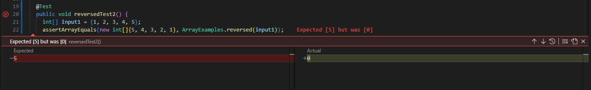

# Part 1: Reversed Bug

## A failure-inducing input for the buggy program, as a JUnit test and any associated code


Failure inducing input
```
@Test 
  public void reversedTest() {
    int[] input1 = {1, 2, 3, 4, 5};
    assertArrayEquals(new int[]{5, 4, 3, 2, 1}, ArrayExamples.reversed(input1));
  }
```

## An input that doesn't induce a failure, as a JUnit test and any associated code

```
@Test 
  public void reversedTest2() {
    int[] input1 = {1, 2, 3, 4, 5};
    assertArrayEquals(new int[]{1, 2, 3, 4, 5}, ArrayExamples.reversed(input1));
  }
```

## The symptom, as the output of running the two tests above




## The bug, as the before-and-after code change required to fix it

Before
```
 static int[] reversed(int[] arr) {
    int[] newArray = new int[arr.length];
    for(int i = 0; i < arr.length; i += 1) {
      arr[i] = newArray[arr.length - i - 1];
    }
    return arr;
  }
```

After
```
  static int[] reversed(int[] arr) {
    int[] newArray = new int[arr.length];
    for(int i = 0; i < arr.length; i += 1) {
      newArray[arr.length - i - 1] = arr[i];
    }
    return newArray;
  }
```

## Briefly describe (2-3 sentences) why the fix addresses the issue

The after code fixes the two errors. First, the bad code was setting elements from the new array which don't even exist yet into the old array. Second, it was returning the old array. The new code correctly sets elements into the new array and returns the new array.

# Part 2 : less


