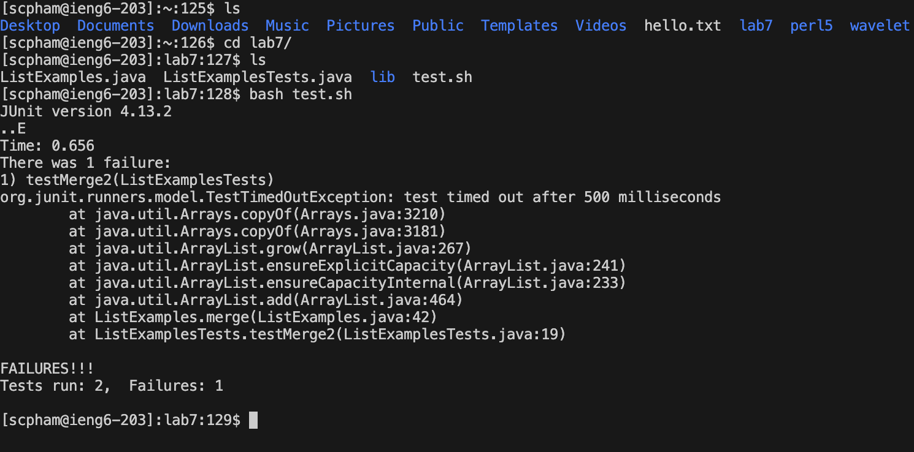

# Lab 4

## Step 4: Log into ieng6


**Keys Pressed**
```
ssh scpham@ieng.ucsd.edu <enter>
```
Summary: Logged in

## Step 5: Use ssh to clone your fork of the repository 


**Keys Pressed**
```
ssh git@github.com:scottinp/lab7.git <enter>
```
Summary: typed ssh and pasted ssh clone link


## Step 6: Run the tests, showing that they fail



**Keys Pressed**
```
ls <enter>
cd lab7 <enter>
ls <enter>
bash tesh.sh <enter>
```
Summary: Checked working directory for cloned repo, went inside, checked inside repo folder, ran test script


## Step 7: Edit code to fix failing test


**Keys Pressed**
```
vim Li<tab> .java <enter>
<shift+g> <up> <up> <up> <up> <up> <up> <up> <right> <right> <right> <right> <right> <right> <right> <right> <right> <right> <right> <right>
i <backspace> 2 <esc>
:wq <enter>
```
Summary: 
Vim the code using tab to autocomplete the file name. Shift G to get to bottom of file in vim. Go up and right to the error. Press I to go into insert mode. Change error. Leave insert mode. Write and quit file.

## Step 8: Run the tests, showing that they succeed


**Keys Pressed**
```
<up> <up> <enter>
```
Summary: bash tesh.sh was a command i already ran so i clicked up arrow to go through my command history.


## Step 9: Commit and push


**Keys Pressed**
```
git add Lis<tab> <enter>
git commit -m "Updated ListExamples.java" <enter>
git push
```
Summary: added file with changes to commit. Added message to commit. Pushed changes
