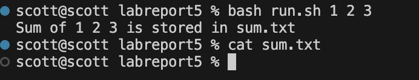
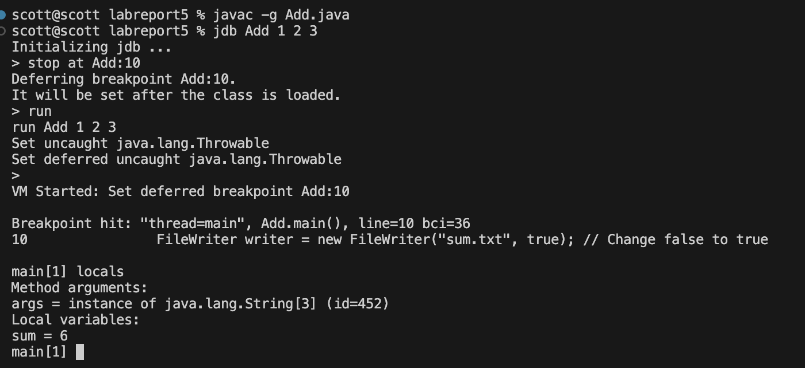

# Part 1

## 1. Student Piazza Post

*Title* : Sum not appearing in text file

> I want to write a java file and bash script to find the sum of arguments and write it into a txt file using FileWriter, but when I run my bash script to add numbers, nothing appears. Here's my input, my bash script, and java file.

input


run.sh
```
javac -g *.java

ARGS="$@"

java Add $ARGS > sum.txt

echo "Sum of $ARGS is stored in sum.txt"
```

Add.java
```
import java.io.*;

public class Add {
    public static void main(String[] args) {
        int sum = 0;
        for (String arg : args) {
            sum += Integer.parseInt(arg);
        }
        try {
            FileWriter writer = new FileWriter("sum.txt", true); // Change false to true
            writer.write("The sum is: " + sum + "\n");
        } catch (IOException e) {
            System.out.println("Error");
            e.printStackTrace();
        }
    }
}

```

## 2. TA Piazza Reply

> Try using jdb to see test if your main function is adding the arguments correctly.
> Try these inputs and see what the variable sum is
```
javac -g Add.java
jdb Add 1 2 3
stop at Add:10
run
locals
```

## 3. Student Reply
> Using jdb, i see that the adding part of the function is correct because the sum is what it should be. I looked at my code for my FileWriter and realized I never closed the writer object. I'll definitely be using jdb more to go line by line in my code and use it to help find errors which aren't quickly identifiable. To fix my bug I added writer.close() after writer.write().



## 4. All information

**File Directory and Structure**

./labreport5/
 - Add.java
 - Add.class
 - run.sh
 - sum.txt

**The contents of each file before fixing the bug**

Add.java
```
import java.io.*;

public class Add {
    public static void main(String[] args) {
        int sum = 0;
        for (String arg : args) {
            sum += Integer.parseInt(arg);
        }
        try {
            FileWriter writer = new FileWriter("sum.txt", true); // Change false to true
            writer.write("The sum is: " + sum + "\n");
        } catch (IOException e) {
            System.out.println("Error");
            e.printStackTrace();
        }
    }
}

```

run.sh
```
javac -g *.java

ARGS="$@"

java Add $ARGS > sum.txt

echo "Sum of $ARGS is stored in sum.txt"
```

sum.txt
```
```

**The full command line (or lines) you ran to trigger the bug**

```
bash run.sh 1 2 3
```

**A description of what to edit to fix the bug**

Add this line of code after line 11 in Add.java
```
writer.close();
```

# Part 2 : Reflection

The second half of the quarter taught me many things, but the one I found most valuable was jdb. Jdb is a new tool I can use to debug my code. Before jdb, I'd have to run the whole java file and see the error at the end, but now I can go through the code line-by-line or stop somewhere specific to check things such as variable values or object identities.
